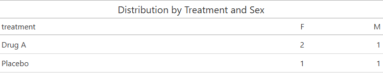
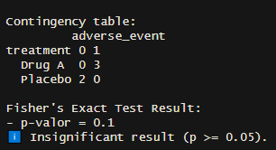
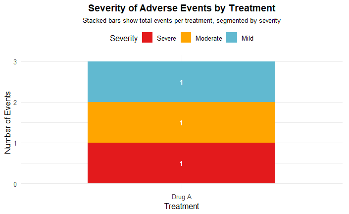

# 🧪 clinical-report-engine  
**Automated TLFs (Tables, Listings, Figures) for Phase I–III Clinical Trials**

> R-based solution for automating regulatory reports — ideal for CROs, biostatisticians, and clinical development professionals..


---

## 💡 What Is It?

A report engine built in R + RMarkdown that automatically generates::

- ✅ Tables for demographics and distributions (gt)
- ✅ Listings of raw clinical data
- ✅ Figures for adverse events (ggplot2)
- ✅ Statistical analysis (Fisher’s Exact Test)
- ✅ Data validation before report generation

Fully reproducible, auditable, and compliant with regulatory best practices (ICH E3, CDISC).

---

## 📦 Technologies

- R (tidyverse, gt, rmarkdown)
- Output formats: Word, HTML, or PDF
- Example dataset in CSV format (semicolon-separated)

---

## 🛠️ Project Structure

The project is organized into three main components:

- **`analysis.Rmd`**: Main notebook that runs all analyses, generates tables, figures, and validations..
- **`R/tlf_functions.R`**: Reusable functions such as create_gt_table().
- **`data/clinical_data.csv`**: Example dataset for demonstration (CSV format, semicolon-separated).

---

## 📊 Example Output

### Distribution by Treatment and Sex


### Adverse Event by Treatment


### Raw Participant Data


### Statistical Analysis


### Demographics by Treatment


### Severity of Adverse Events by Treatment


---

## ▶️ How to Run

```r
# 1. Clone the repository
# 2. Install dependencies
install.packages(c("tidyverse", "gt", "rmarkdown"))

# 3. Render the report
rmarkdown::render("analysis.Rmd", output_format = "word_document")
