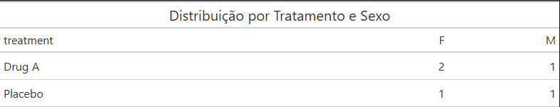
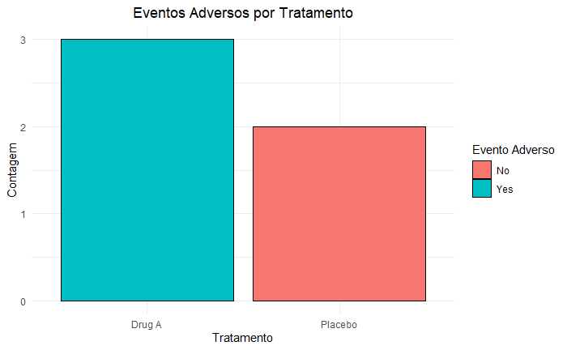
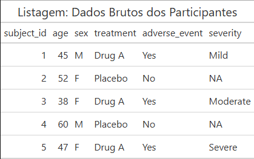
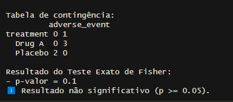
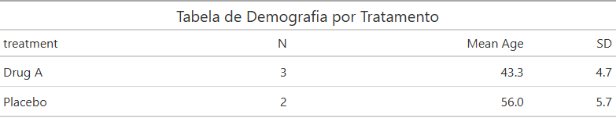
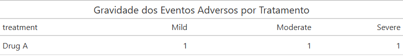

# 🧪 clinical-report-engine  
**Automated TLFs (Tables, Listings, Figures) for Phase I–III Clinical Trials**

> Solução em R para automação de relatórios regulatórios — ideal para CROs, bioestatísticos e profissionais de desenvolvimento clínico.


---

## 💡 O que é?

Motor de relatórios clínicos em **R + RMarkdown** que gera automaticamente:

- ✅ **Tabelas** de demografia e distribuição (com `gt`)
- ✅ **Listagens** dos dados brutos
- ✅ **Figuras** de eventos adversos (`ggplot2`)
- ✅ **Análise estatística** (Teste Exato de Fisher)
- ✅ **Validação de dados** antes da geração

Totalmente **reprodutível, auditável e alinhado às boas práticas regulatórias** (ICH E3, CDISC).

---

## 📦 Tecnologias

- **R** (`tidyverse`, `gt`, `rmarkdown`)
- Saída em **Word, HTML ou PDF**
- Dados de exemplo em formato **CSV (compatível com separador `;`)**

---

## 🛠️ Estrutura do Projeto

O projeto é organizado em três partes principais:

- **`analysis.Rmd`**: Notebook principal que executa todas as análises, gera tabelas, gráficos e validações.
- **`R/tlf_functions.R`**: Funções reutilizáveis, como `create_gt_table()`.
- **`data/clinical_data.csv`**: Dados de exemplo usados para demonstração (formato CSV com separador `;`).

---

## 📊 Exemplo de Saída

### Distribuicao por Tratamento e Sexo


### Evento Adverso por Tratamento


### Dados Brutos dos Participantes


### Análise Estatística


### Demografia por Tratamento


### Gravidade dos Eventos Adversos por Tratamento

---

## ▶️ Como Executar

```r
# 1. Clone o repositório
# 2. Instale dependências
install.packages(c("tidyverse", "gt", "rmarkdown"))

# 3. Gere o relatório
rmarkdown::render("analysis.Rmd", output_format = "word_document")
